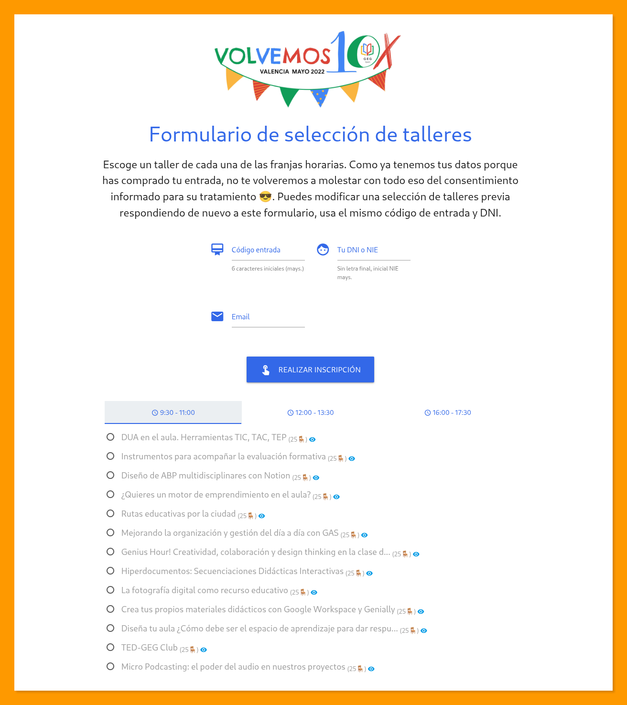

# Webapp de inscripción a talleres

Una aplicación web altamente parametrizable construida con **Google Apps Script** para gestionar inscripciones a eventos y talleres de forma eficiente, segura y sin necesidad de conocimientos de programación para su gestión diaria.

Este proyecto permite transformar una hoja de cálculo de Google en un completo sistema de reservas con control de aforo en tiempo real, validación de identidad y notificaciones automáticas por correo electrónico.

## 🚀 Características principales

- **Gestión desde Google Sheets:** Todo el contenido (textos, imágenes, colores, periodos de apertura) se configura desde una pestaña de la hoja de cálculo.
- **Control de aforo (concurrencia segura):** Utiliza `LockService` para garantizar que no se sobrepasen las plazas disponibles, incluso con cientos de usuarios accediendo simultáneamente.
- **Interfaz dinámica:** Generación automática de pestañas y selectores según los grupos de talleres definidos en la base de datos.
- **Validación de identidad:** Permite restringir el acceso comparando los datos introducidos con una tabla de usuarios autorizados.
- **Inscripciones múltiples/actualización:** Configurable para impedir duplicados o permitir que los usuarios modifiquen su selección previa.
- **Notificaciones por email:** Envío automático de confirmaciones con los talleres seleccionados mediante plantillas HTML personalizables.
- **Diseño responsive:** Interfaz basada en Materialize CSS optimizada para dispositivos móviles y escritorio.

## 📊 Plantilla de Google Sheets

La aplicación se apoya en una hoja de cálculo que actúa tanto de base de datos como de panel de control. Puedes obtener una copia de la plantilla necesaria en el siguiente enlace:

👉 [**Plantilla de gestión de inscripciones**](https://docs.google.com/spreadsheets/d/1wG2IB0GSGhkdiJJph-iP1wWT5OlQBYF4aWddZ67XluI/edit?usp=sharing)

El papel de esta hoja es fundamental, ya que permite:
- **Configurar la webapp:** Sin editar una sola línea de código, puedes cambiar el aspecto visual, los textos de ayuda, las validaciones de campos y los tiempos de apertura del formulario.
- **Gestionar el catálogo de talleres:** Añadir, editar o eliminar talleres y grupos horaria, así como definir sus aforos.
- **Centralizar los datos:** Recibir las inscripciones en tiempo real y gestionar la lista de usuarios autorizados.

## 🛠️ Guía de la pestaña Configuración

La potencia de esta webapp reside en su capacidad de ser gestionada íntegramente desde la pestaña **Configuración** de la hoja de cálculo. A continuación se detallan los elementos parametrizables:

### **1. Lógica de disponibilidad (Apertura y Cierre)**
El acceso al formulario se rige por tres estados jerárquicos:
- **Modo mantenimiento (H18):** Es la prioridad absoluta. Si se activa la casilla, la webapp muestra un **mensaje fijo** (`🛠️ El formulario está temporalmente desactivado por labores de mantenimiento 🛠️`) y bloquea cualquier acción.
- **Control por periodo (H7, E7, G7):** Si el mantenimiento está desactivado y esta casilla es `TRUE`, el formulario se abrirá y cerrará automáticamente en las fechas y horas indicadas en **Apertura** y **Cierre**.
- **Interruptor manual (A7):** Si el control por periodo es `FALSE`, el formulario se abre o cierra manualmente marcando esta casilla.
- **Mensajes dinámicos:** 
    - **Texto abierto (B16):** Mensaje de bienvenida visible cuando el formulario está activo.
    - **Texto cerrado (B18):** Mensaje que aparece cuando el formulario está cerrado (ya sea por fecha o por el interruptor manual).

### **2. Cabecera y Estética**
- **Imagen (B12) y Anchura (I12):** URL de la imagen de cabecera y su tamaño relativo (ej. 50%).
- **Título (B10) y Tamaño (G10):** Texto del encabezado y su nivel HTML (1-6).
- **Color del tema (I10):** Código hexadecimal (ej. `#3369e8`) que personaliza botones, títulos e iconos automáticamente.

### **3. Campos de Identificación (Filas 20-25)**
Permite configurar hasta **4 campos de identificación** con:
- **Etiquetas e Iconos:** Nombres de los campos e iconos de Material Design.
- **Validación avanzada (ExpReg):** Puedes obligar a que el usuario introduzca datos con un formato específico (DNI, Email, código alfanumérico) y definir un mensaje de error personalizado.

### **4. Política de Inscripción y Talleres**
- **Gestión de duplicados (D38):** Permite configurar si un usuario puede inscribirse una sola vez o si puede modificar una selección previa (actualización).
- **Validación de identidad (G39):** Interruptor para exigir que los datos del usuario existan previamente en la pestaña `Identificación`.
- **Visualización de talleres (Filas 31-35):** Iconos de las pestañas horarias, límite de caracteres en nombres y campo para enlazar fichas técnicas.

### **5. Notificaciones por Email**
- **Envío automático (B45):** Activa o desactiva la confirmación tras la inscripción.
- **Cuerpo del mensaje (B50):** Plantilla HTML personalizable que admite marcadores dinámicos:
    - `$IMAGEN$`: Imagen de cabecera.
    - `$CAMPO1$`, `$CAMPO2$`...: Datos introducidos por el usuario.
    - `$GRUPO1$`, `$GRUPO2$`...: Nombres de los talleres seleccionados.

## 💻 Requisitos técnicos

- Cuenta de Google (Personal o Workspace).
- Google Apps Script (entorno de ejecución V8).
- Google Sheets como base de datos y panel de control.

---

## 🤝 Créditos

Este proyecto ha sido creado y es mantenido por **Pablo Felip** ([LinkedIn](https://www.linkedin.com/in/pfelipm/) | [GitHub](https://github.com/pfelipm)).

Diseñado para [**GEG Spain** / **Transformación Educativa**](https://transformacioneducativa.es/).

## 📄 Licencia

Este proyecto se distribuye bajo los términos del archivo [LICENSE](LICENSE).
